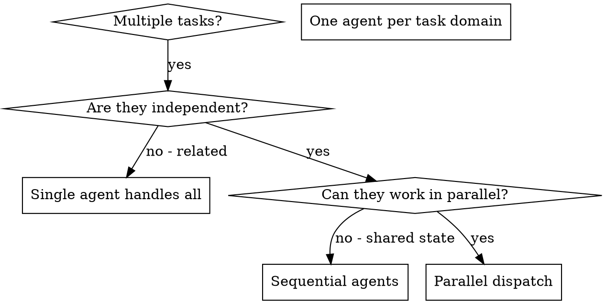

# Dispatching Parallel Agents

## Overview

You delegate tasks to specialized agents with isolated context. By precisely crafting their instructions and context, you ensure they stay focused and succeed at their task. They should never inherit your session's context or history — you construct exactly what they need. This also preserves your own context for coordination work.

When you have multiple unrelated tasks (different files, different subsystems, different concerns), handling them sequentially wastes time. Each task is independent and can happen in parallel — whether it's research, implementation, refactoring, review, or debugging.

**Core principle:** Dispatch one agent per independent task domain. Let them work concurrently.

## When to Use



**Use when:**
- 3+ independent areas to investigate, implement, refactor, or review
- Multiple subsystems that need separate work
- Each task can be understood without context from the others
- No shared state or file conflicts between agents

**Don't use when:**
- Tasks are related (one's outcome affects another)
- Need to understand full system state in a single coherent view
- Agents would interfere with each other (editing same files, same resources)

## The Pattern

### 1. Identify Independent Domains

Group work by what's separable. Examples across task types:
- **Research:** Codebase area X; library Y; external API docs Z
- **Implementation:** API endpoint A; UI component B; data migration C
- **Refactor:** Module A cleanup; Module B rename; Module C API change
- **Review:** Service A; service B; service C
- **Debugging:** File A tests (tool approval); File B tests (batch completion); File C tests (abort)

Each domain is independent — work in one doesn't depend on the others.

### 2. Create Focused Agent Tasks

Each agent gets:
- **Specific scope:** One file, module, or subsystem
- **Clear goal:** What "done" looks like (e.g. "summarize findings", "make these tests pass", "implement endpoint X")
- **Constraints:** What not to touch
- **Expected output:** Summary, diff, findings, or whatever the parent needs to integrate

### 3. Dispatch in Parallel

```typescript
// In Claude Code / AI environment
Task("Investigate auth flow in src/auth/ and report how tokens are refreshed")
Task("Implement /search endpoint per spec in docs/api/search.md")
Task("Refactor logger in src/utils/log.ts to use structured logging")
// All three run concurrently
```

### 4. Review and Integrate

When agents return:
- Read each summary
- Verify outputs don't conflict (overlapping edits, contradictory findings)
- Run any needed verification (tests, type-check, build)
- Integrate all changes into a coherent whole

## Agent Prompt Structure

Good agent prompts are:
1. **Focused** - One clear task domain
2. **Self-contained** - All context needed (the agent never sees your session history)
3. **Specific about output** - What should the agent return?

Concrete example (debugging task — same shape applies to research, implementation, or refactor prompts):

```markdown
Fix the 3 failing tests in src/agents/agent-tool-abort.test.ts:

1. "should abort tool with partial output capture" - expects 'interrupted at' in message
2. "should handle mixed completed and aborted tools" - fast tool aborted instead of completed
3. "should properly track pendingToolCount" - expects 3 results but gets 0

These are timing/race condition issues. Your task:

1. Read the test file and understand what each test verifies
2. Identify root cause - timing issues or actual bugs?
3. Fix by:
   - Replacing arbitrary timeouts with event-based waiting
   - Fixing bugs in abort implementation if found
   - Adjusting test expectations if testing changed behavior

Do NOT just increase timeouts - find the real issue.

Return: Summary of what you found and what you fixed.
```

## Common Mistakes

**❌ Too broad:** "Clean up the codebase" — agent gets lost
**✅ Specific:** "Refactor src/utils/log.ts to use structured logging" — focused scope

**❌ No context:** "Investigate the auth bug" — agent doesn't know where to start
**✅ Context:** Paste the relevant file paths, error messages, or specifications

**❌ No constraints:** Agent ranges far beyond the intended scope
**✅ Constraints:** "Edit only files under src/api/" or "Read-only investigation"

**❌ Vague output:** "Do it" — you don't know what came back
**✅ Specific:** "Return a summary of findings and a list of files changed"

## When NOT to Use

**Related tasks:** One task's outcome changes another's — handle together first
**Need full context:** A coherent answer requires seeing the entire system at once
**Exploratory work:** You don't yet know how to decompose the problem
**Shared state:** Agents would interfere (editing the same files, contending for the same resources)

## Real Example from Session

**Scenario:** 6 test failures across 3 files after major refactoring

**Failures:**
- agent-tool-abort.test.ts: 3 failures (timing issues)
- batch-completion-behavior.test.ts: 2 failures (tools not executing)
- tool-approval-race-conditions.test.ts: 1 failure (execution count = 0)

**Decision:** Independent domains - abort logic separate from batch completion separate from race conditions

**Dispatch:**
```
Agent 1 → Fix agent-tool-abort.test.ts
Agent 2 → Fix batch-completion-behavior.test.ts
Agent 3 → Fix tool-approval-race-conditions.test.ts
```

**Results:**
- Agent 1: Replaced timeouts with event-based waiting
- Agent 2: Fixed event structure bug (threadId in wrong place)
- Agent 3: Added wait for async tool execution to complete

**Integration:** All fixes independent, no conflicts, full suite green

**Time saved:** 3 problems solved in parallel vs sequentially

## Key Benefits

1. **Parallelization** - Multiple tasks progress simultaneously
2. **Focus** - Each agent has narrow scope, less context to track
3. **Independence** - Agents don't interfere with each other
4. **Speed** - N tasks completed in roughly the time of 1

## Verification

After agents return:
1. **Review each summary** - Understand what was done or found
2. **Check for conflicts** - Did agents edit overlapping code or contradict each other?
3. **Run verification** - Tests, type-check, build, or whatever validates the integrated result
4. **Spot check** - Agents can make systematic errors; sample their work

## Real-World Impact

From debugging session (2025-10-03):
- 6 failures across 3 files
- 3 agents dispatched in parallel
- All investigations completed concurrently
- All fixes integrated successfully
- Zero conflicts between agent changes
